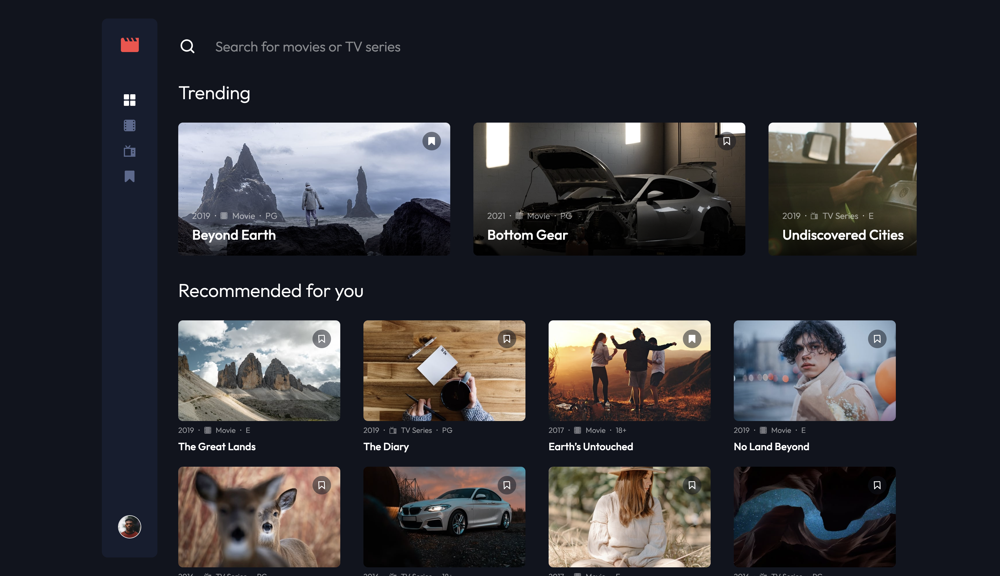

# Frontend Mentor - Entertainment web app solution

This is a solution to the [Entertainment web app challenge on Frontend Mentor](https://www.frontendmentor.io/challenges/entertainment-web-app-J-UhgAW1X). Frontend Mentor challenges help you improve your coding skills by building realistic project.

## Table of contents

- [Overview](#overview)
  - [The challenge](#the-challenge)
  - [Screenshot](#screenshot)
  - [Links](#links)
- [My process](#my-process)
  - [Built with](#built-with)
  - [What I learned](#what-i-learned)
- [Author](#author)

## Overview

### The challenge

Users should be able to:

- View the optimal layout for the app depending on their device's screen size
- See hover states for all interactive elements on the page
- Navigate between Home, Movies, TV Series, and Bookmarked Shows pages
- Add/Remove bookmarks from all movies and TV series
- Search for relevant shows on all pages

### Screenshot

### Links

- Solution URL: [(https://your-solution-url.com)](https://github.com/DimitarK13/frontend-mentor-projects/tree/master/entertainment-web-app)
- Live Site URL: [Add live site URL here](https://dk-entertainment-web-app.netlify.app/)

## My process

### Built with

- React
- TypeScript
- React Context
- CSS
- Mobile-first workflow

### What I learned

This was my first official React/TypeScript project since finishing a course for TS, and I couldn't be more proud. I know that there are probably areas that I will need to improve, but for a first project, it turned out great.

## Author

- Website - [Add your name here](https://dimitark.com)
- Frontend Mentor - [@yourusername](https://www.frontendmentor.io/profile/DimitarK13)
- Twitter - [@yourusername](https://x.com/dimitar_kalapoc)
