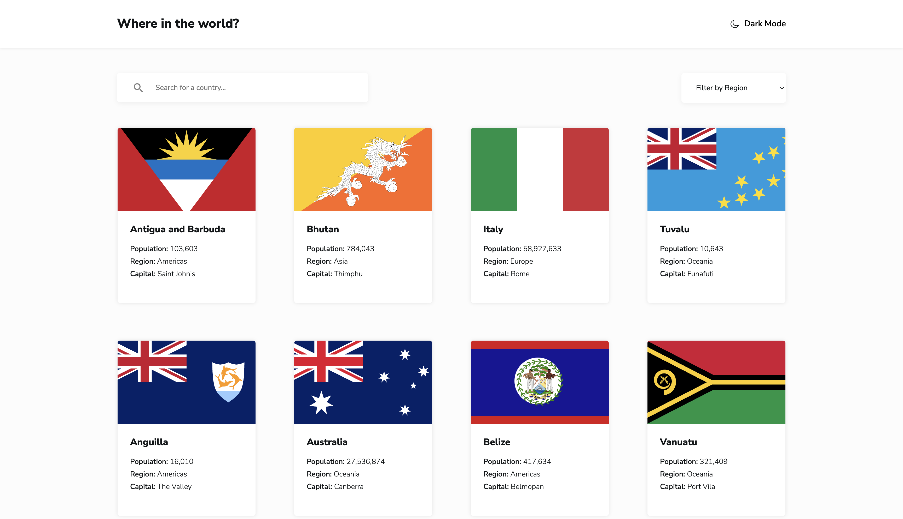

# Frontend Mentor - REST Countries API with color theme switcher solution

This is a solution to the [REST Countries API with color theme switcher challenge on Frontend Mentor](https://www.frontendmentor.io/challenges/rest-countries-api-with-color-theme-switcher-5cacc469fec04111f7b848ca). Frontend Mentor challenges help you improve your coding skills by building realistic projects.

## Table of contents

- [Overview](#overview)
  - [The challenge](#the-challenge)
  - [Screenshot](#screenshot)
  - [Links](#links)
- [My process](#my-process)
  - [Built with](#built-with)
  - [Continued development](#continued-development)
- [Author](#author)

## Overview

### The challenge

Users should be able to:

- See all countries from the API on the homepage
- Search for a country using an `input` field
- Filter countries by region
- Click on a country to see more detailed information on a separate page
- Click through to the border countries on the detail page
- Toggle the color scheme between light and dark mode _(optional)_

### Screenshot

### Links

- Solution URL: [Add solution URL here](https://github.com/DimitarK13/frontend-mentor-projects/tree/master/rest-countries-api)
- Live Site URL: [Add live site URL here](https://dk-rest-countries-api.netlify.app/)

## My process

### Built with

- React
- TypeScript
- Flexbox
- CSS Grid
- Mobile-first workflow
- SCSS

### Continued development

In the future I would love to try out TailwindCSS. For this project I decided to go with SCSS because on day-to-day basis I work with SCSS, but never with React.

## Author

- Website - [Add your name here](https://dimitark.com)
- Frontend Mentor - [@yourusername](https://www.frontendmentor.io/profile/DimitarK13)
- Twitter - [@yourusername](https://x.com/dimitar_kalapoc)
